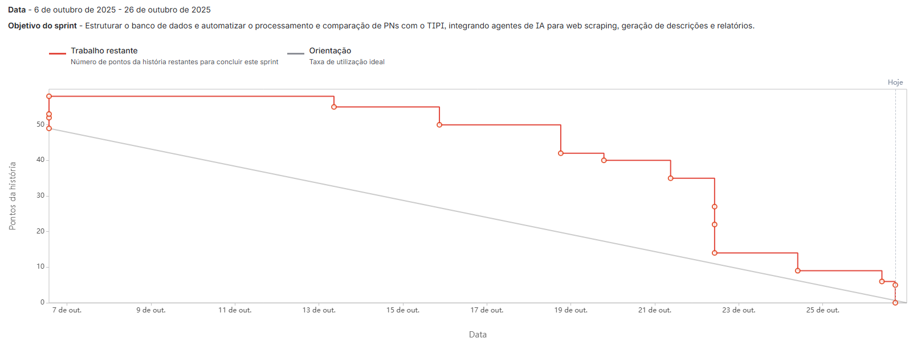
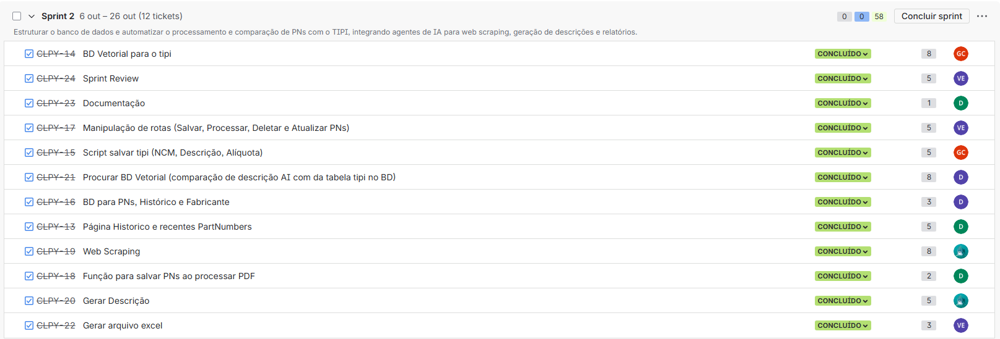

# API - 4º Semestre ADS

# ClassiPy

# Documentação - Sprint 1

     <h2 align="center"> Bug Busters</h2>

 | <a href ="#desafio"> Desafio da Sprint</a>  |
 <a href ="#user-stories"> User Stories</a>  |
 <a href ="#burndown-sprint"> Burndown</a> |
 <a href ="#backlog"> Backlog</a> |
 <a href ="#dor">DoR</a>  |
 <a href ="#dod">DoD</a>  |
 <a href ="#equipe"> Equipe</a> |

> Status da Sprint: Concluída ✅

## Desafio 
O objetivo principal da Sprint 2 foi aprimorar e expandir as funcionalidades do ClassiPy, garantindo a integração completa entre as camadas do sistema e aumentando a confiabilidade do fluxo de classificação. O foco será otimizar o processamento dos dados extraídos, implementar a persistência no banco de dados, permitir a exclusão e atualização de registros diretamente pela interface e melhorar a experiência do usuário com feedbacks visuais e validações mais robustas.

## 📋 User Stories 

| Rank | Prioridade | User Story                                                                                                                            | Status |
| :--: | :--------: | ------------------------------------------------------------------------------------------------------------------------------------- | :----: |
|  4   |    Alta    | Como operador de cadastro, eu gostaria de visualizar de forma clara as informações classificadas de cada peça (descrição, NCM, alíquota, fabricante e origem) para validar antes da exportação. |   ✅   |
|  5   |    Média    | Como operador de cadastro, eu gostaria de editar manualmente informações classificadas caso o sistema apresente dados incorretos ou incompletos.      |   ✅   |
|  6   |   Média    | Como analista de importação, eu gostaria de exportar as informações classificadas em planilha Excel no formato padrão da empresa, para facilitar a entrega do processo de registro.       |   ✅   |
|  7   |   Média    | Como operador de cadastro, eu gostaria de receber uma prévia dos resultados processados antes de salvar ou exportar, para evitar erros.       |   ✅   |

---

## 📉 Burndown Sprint 

## 🎯 Backlog Sprint <a id="backlog">

## 🏅 DoR - Definition of Ready 

| Critério                          | Descrição                                                                                              |
| :-------------------------------- | ------------------------------------------------------------------------------------------------------ |
| **Clareza na Descrição**          | A User Story está escrita no formato “Como [persona], quero [ação] para que [objetivo]”.               |
| **Critérios de Aceite Definidos** | A história possui critérios objetivos que indicam o que é necessário para considerá-la concluída.      |
| **Protótipo/Design Disponível**   | Se a tarefa envolve UI, mockups ou fluxos de tela estão anexados ou referenciados.                     |
| **Contrato de API Acordado**      | As necessidades de comunicação entre Frontend e Backend foram claramente definidas (quando aplicável). |
| **Modelo de Dados Validado**      | O modelo de dados relacionado à tarefa foi validado pela equipe.                                       |
| **Compreensão Compartilhada**     | Toda a equipe (incluindo PO e devs) compreende o propósito e o escopo da história.                     |
| **Estimável**                     | A história foi pontuada ou tem uma estimativa clara.                                                   |

## 🏅 DoD - Definition of Done 

| Critério                            | Descrição                                                                                      |
| :---------------------------------- | ---------------------------------------------------------------------------------------------- |
| **Critérios de Aceite Atendidos**   | Todos os critérios de aceite da história foram implementados e validados.                      |
| **Código Implementado e Funcional** | A funcionalidade foi desenvolvida em uma branch `feature/` e não quebra a aplicação.           |
| **Testes Manuais Realizados**       | O fluxo da funcionalidade foi testado manualmente pelo desenvolvedor, incluindo casos de erro. |
| **Código Revisado (Code Review)**   | O Pull Request foi revisado e aprovado por pelo menos um outro membro da equipe.               |
| **Integração à `main`**             | O código foi integrado à branch `main` após a aprovação.                                       |
| **Documentação Atualizada**         | O `README.md` ou outra documentação relevante foi atualizada para refletir as novas mudanças.  |
| **Validação do PO**                 | O Product Owner validou a entrega com base nos critérios definidos.                            |

---

## Colaboradores 

| Função        | Nome           |
| :------------ | :------------- |
| Product Owner | Humberto Ishii |
| Scrum Master  | Diego Castilho |
| Team Member   | Gabriel Viell  |
| Team Member   | Vinicius Elias |
| Team Member   | Davi Miyake    |
